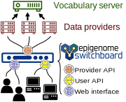

# Epigenome switchboard

**The epigenome switchboard is a web app that integrates large-scale epigenome data across databases.**

It is made up of *data providers* and *data hubs* that together provide fast web and API access to data from many different public data sources. Via a [subscription interface](/howto-subscribe/), users can add new public or private data providers into their switchboards, enabling them to easily integrate their own data with other curated data resources via the hub.

### Prerequisite: A controlled vocabulary

 
Components that make up the epigenome switchboard

In order to be integrated, the distributed data must use a controlled vocabulary. We are implementing an epigenome-specific controlled vocabulary called [bioterms](controlled-vocabulary) that builds on existing work from the [Sequence Ontology](http://www.sequenceontology.org/) and [schema.org](http://schema.org).

The `epigenome switchboard` is made up of 2 components:

### 1. One or more data providers

A data provider is a generic server that hosts actual epigenome data. The data is stored as *regions* (*a.k.a.* genomic intervals). This is a RESTful server that provides access to the raw data via the [data provider API](/provider-api/). We provide a containerized system so that a third party with either public or private data could fit that data into a data provider instance that would integrate with the epigenome switchboard.

Our protoype data provider is housed here:

- URL: [http://provider.episb.org/episb-provider](http://provider.episb.org/episb-provider)
- Github: [https://github.com/databio/episb-provider](https://github.com/databio/episb-provider)

### 2. The hub, or query overlay server

The *hub* links together data providers, and then provides access that data for users. A hub can be accessed in 2 ways: a [web interface](http://episb.org) for user-friendly data queries, and a documented [hub API for programmatic access](/hub-api/) to integrated data. A hub connects any number of public or private data providers. Furthermore, there can be several hubs, each one connecting a different set of data providers. For example, a given hub may focus on private data, or a certain species or data type, *etc*.

Our protoype hub is housed here:

- URL: [http://episb.org](http://episb.org)
- Github: [https://github.com/databio/episb-hub](https://github.com/databio/episb-hub)
